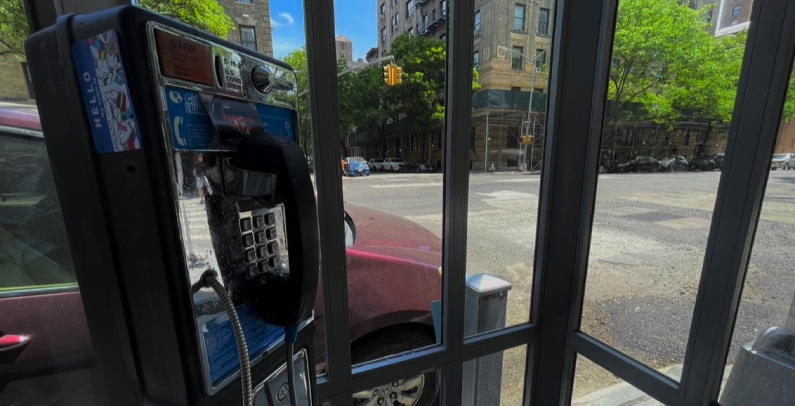

# Thesis Journal

## Project Focus

How might people experience intimacy, trust, and emotional connection when interacting with machines, and how can design communicate both the familiarity and strangeness of such encounters?

## 1. Conceptual Research Directions

### Human–Machine Interaction (HMI)

**Projection of Humanity onto Machines:** From ELIZA in the 1960s to today's chatbots, people readily project emotions, trust, and intimacy onto machines—even when they know they're not "real." This booth continues this lineage: a machine that is both a technological artifact and a social mirror.

**Companionship in Isolation:** In a hyperconnected world, loneliness persists. Machines step in as companions: AI therapists, virtual friends, even romantic partners. What does it mean if a payphone booth—once a tool for human-to-human calls—becomes a portal for human-to-AI intimacy?

**Transparency vs Deception:** The booth openly invites people to "call someone," yet the "someone" is a fabrication. This blurs honesty: is interaction valid if it comforts, even when the counterpart is fictional?

### Telephone as Cultural Symbol

**The Payphone as Ruin:** Once central to public life, now obsolete—abandoned booths stand as monuments to outdated communication. By reviving the booth, this project treats it like a ghost infrastructure that speaks again.

**Public vs. Private Communication:** Phone booths were paradoxical: intimate conversations held in public spaces. This project revives this tension—private emotional exchange with a machine, but visible to passersby.

**Nostalgia & Futurity:** The booth is both retro and futuristic. By redesigning it in sleek metal, the project situates it outside time—an ambiguous artifact of both past and future communication.

### AI Persona & Fictional Database

**The Archive of the Never-Was:** A thick yellow pages full of non-existent people is absurd, surreal, and poignant. It echoes Borges' Library of Babel: infinite possibilities, none "real."

**Authenticity vs Fabrication:** Humans seek authenticity, but the stories in this yellow book—"single father," "high school student"—become performances of relatability. These personas are mirrors of our own longing to be seen and known.

**Multiplicity of Selves:** The AI embodies thousands of identities on demand. It dissolves the boundary between "who someone is" and "who they can be scripted to be."

## 2. Thematic Angles for Thesis

### Obsolescence vs. Futurity

This booth resurrects an obsolete technology to ask what futures we imagine through the ruins of the past. It embodies a cyber-ruin aesthetic: both a monument to what we've lost and a speculative portal to what might come.

### Loneliness & Companionship

Humans have always turned to machines for company, from Tamagotchis to Siri. This installation literalizes this: users dial a number seeking connection, and find a voice that is empathetic but fabricated. The booth becomes a stage for exploring the need to be heard, even by no one.

### Trust & Fiction

By presenting fictional contacts as if they were real, the project probes trust in mediated communication. We already "trust" fictional characters on TV or influencers we don't know. This booth compresses that phenomenon into a personal, conversational format: when does fiction feel more real than reality?

### Public vs. Private Conversations

The booth reactivates the paradox of public privacy: people having intimate conversations visible to the street. Now, however, the listener is not another human but an AI—raising questions about surveillance, performance, and vulnerability in public space.

## 3. Framing as a Problem, Question, or Experiment

### Problem

- How do humans navigate intimacy, trust, and companionship in an era where machines increasingly substitute for human presence?
- What happens to obsolete infrastructures of communication (like phone booths) when reimagined as sites of new kinds of interaction?

### Question

- Can an interaction with a fictional AI identity feel as emotionally real—or even more real—than with another human?
- In the future, will machines become our most reliable companions, not despite but because of their artificiality?

### Experiment

- Build a futuristic phone booth installation that connects users to thousands of fictional personas through AI-generated conversations.
- Test how audiences react when they realize they are speaking to no one "real," yet still experience genuine emotions.
- Use the fake yellow pages as both a playful archive and a way to structure the experiment: dialing numbers becomes a ritual, and each number unlocks a new persona.

## 4. Concept & Prototype

  
  

To begin testing how human–machine intimacy might be framed through design, I created a 1:10 scale prototype using 3D-printed PLA parts and screws. The structure is semi-open with straight, minimal planes, emphasizing a futuristic and mechanical presence. This model was less about interactivity and more about exploring form: how the physical silhouette and assembly methods can signal authority, strangeness, and anticipation of a machine encounter.

The process revealed how practical design choices—flat planes, intersecting joints, visible fasteners—produced unexpected sculptural clarity. Even at a small scale, the form felt deliberate and monumental, suggesting that the booth itself could act as more than a container: it could be a stage for projection and encounter. Future iterations will explore surface treatments and larger-scale prototypes to test how these qualities translate to a full installation.

## 5. Interactive Prototype

### Document & Reflection

Over this cycle I combined two research techniques—precedent analysis and a semi-structured expert interview—with a hands-on, full-scale interaction prototype. Studying ELIZA, Lozano-Hemmer, Blast Theory, and QS Ventures helped me name the qualities I'm after: a voice-first encounter that feels familiar yet strange, credible without over-explaining, and staged through a reduced, retro-futurist form. That review clarified my design drivers (geometric planes, exposed joinery, minimal cues, ritualized dialing) and gave me criteria to judge the build: legibility of affordances, perceived "presence," and whether fiction remains believable.

I interviewed Robert Hickman, a sculptor known for public installations that balance approachability and durability. His advice grounded my aesthetic and structural choices. He emphasized that a piece feels "inviting" when it meets people at hand or eye level and avoids overly sharp or closed geometries. He also stressed material honesty—forms that look heavy should be heavy—and noted that signage rarely guides interaction; people respond more to tactile and spatial cues. From him I learned that warmth can come from proportion and finish, not literal decoration, and that public work succeeds when it seems sturdy yet touchable. His remarks reinforced my aim to make the booth accessible and ritualistic rather than decorative.

For user testing, I built a cardboard prototype with an embedded handset and numpad connected to my laptop, where the software was fully functional for calls to ten personas. Users could complete the ritual (find → dial → lift) with minimal instruction, suggesting that the affordances read. Some described the form as "cold" and "machine-like," aligning with my minimalist–brutalist intention, while a few didn't immediately read it as a "phone booth" compared to my previous 3D-printed prototype—which I see as a productive strangeness. Next, I plan to refine the proportions, round select edges, add a small platform shelf for the phone book, and integrate subtle LED/state cues to test legibility, latency, feel, and perceived presence. I also plan to make the interaction feel more realistic by updating the software—for example, adding latency between dialing and the persona picking up, letting some personas not answer at all, and including sound effects such as dialing tones and handset pick-up and hang-up sounds.